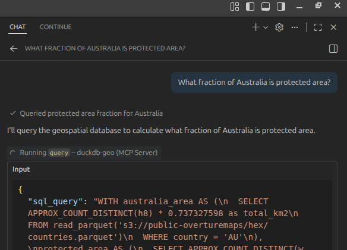

# MCP DuckDB Geospatial Data Server

**[Documentation](https://boettiger-lab.github.io/mcp-data-server/)**

A [Model Context Protocol (MCP)](https://modelcontextprotocol.io/) server that provides SQL query access to large-scale geospatial datasets stored in S3. Built with DuckDB for high-performance analytics on H3-indexed environmental, biodiversity, and geospatial data.

## Quick Start

Add the hosted MCP endpoint to your LLM client, like so: 


### Using VSCode

create a  `.vscode/mcp.json` like this: ([as in this repo](.vscode/mcp.json))

```json
{
	"servers": {
		"duckdb-geo": {
			"url": "https://duckdb-mcp.nrp-nautilus.io/mcp"
		}
	}
}
```

 
Now simply ask your chat client a question about the datasets and it should answer by querying the database in SQL:

Examples:

- What fraction of Australia is protected area?  





### Using Claude Code (CLI)

Run this command once in your terminal:

```bash
claude mcp add --transport http duckdb-geo https://duckdb-mcp.nrp-nautilus.io/mcp
```

To make it available across all your projects, add `--scope user`:

```bash
claude mcp add --transport http --scope user duckdb-geo https://duckdb-mcp.nrp-nautilus.io/mcp
```

### Using Claude Desktop

Add to your Claude Desktop configuration file:

**macOS**: `~/Library/Application Support/Claude/claude_desktop_config.json`  
**Windows**: `%APPDATA%\Claude\claude_desktop_config.json`  
**Linux**: `~/.config/Claude/claude_desktop_config.json`

```json
{
  "mcpServers": {
    "duckdb-geo": {
      "url": "https://duckdb-mcp.nrp-nautilus.io/mcp"
    }
  }
}
```

After adding the configuration, restart Claude Desktop.


## Features

- **Zero-Configuration SQL Access**: Query petabytes of geospatial data without database setup
- **H3 Geospatial Indexing**: Efficient spatial operations using Uber's H3 hexagonal grid system
- **Isolated Execution**: Each query runs in a fresh DuckDB instance for security
- **Stateless HTTP Mode**: Fully horizontally scalable for cloud deployment
- **Rich Dataset Catalog**: Access to 10+ curated environmental and biodiversity datasets
- **MCP Resources & Prompts**: Browse datasets and get query guidance through MCP protocol

## Available Datasets

The example configuration provides access to the following datasets via S3:

1. **GLWD** - Global Lakes and Wetlands Database
2. **Vulnerable Carbon** - Conservation International carbon vulnerability data
3. **NCP** - Nature Contributions to People biodiversity scores
4. **Countries & Regions** - Global administrative boundaries (Overture Maps)
5. **WDPA** - World Database on Protected Areas
6. **Ramsar Sites** - Wetlands of International Importance
7. **HydroBASINS** - Global watershed boundaries (levels 3-6)
8. **iNaturalist** - Species occurrence range maps
9. **Corruption Index 2024** - Transparency International data

Datasets are discovered dynamically from the STAC catalog via the `list_datasets` and `get_dataset` tools.


## Local Development


You can also run the server locally


Or install dependencies and run directly:

```bash
pip install -r requirements.txt
python server.py
```


You can now connect to the server over localhost (note http not https here), e.g. in VSCode: 


```json
{
	"servers": {
			"duckdb-geo": {
			"url": "http://localhost:8000/mcp"
		},
	}
}
```

You can adjust the instructions to the LLM in the corresponding `.md` files (e.g. `query-optimization.md`, `h3-guide.md`).  You will need to adjust `query-setup.md` to run the server locally, as it uses endpoint and thread count that only work from inside our k8s cluster.
Running locally means your local CPU+network resources will be used for the computation, which will likely be much slower than the hosted k8s endpoint. 


## Architecture

We have a fully-hosted version 

### Core Components

- **server.py** - Main MCP server with FastMCP framework
- **stac.py** - STAC catalog integration for dynamic dataset discovery

### Runtime Prompt Files

The `.md` files in this repo are **not documentation** — they are curated prompt content loaded by `server.py` at startup and injected directly into MCP tool descriptions and prompts at runtime. The agent (LLM) reads them as instructions, not humans.

| File | How it is used |
|---|---|
| `query-setup.md` | SQL parsed and executed in every fresh DuckDB connection before a query runs |
| `query-optimization.md` | Injected verbatim into the `query` tool description |
| `h3-guide.md` | Injected verbatim into the `query` tool description |
| `assistant-role.md` | Served as the `geospatial-analyst` MCP prompt (role + response style) |

Editing these files changes what the agent is told to do. They must be written for a stateless LLM — short, concrete, and unambiguous. See `AGENTS.md` for editing rules.

### Key Design Patterns

1. **Isolation Engine**: Each query runs in a fresh `duckdb.connect(":memory:")` — no state or credentials survive between requests
2. **Context Injection**: Prompt files are embedded into tool descriptions so even MCP clients that don't support `prompts/list` receive the guidance
3. **Partition Pruning**: H3 resolution columns (`h0`) enable DuckDB to skip S3 partitions, giving 5–20× speedups on large datasets

## Kubernetes Deployment

Deploy to Kubernetes using the provided manifests:

```bash
kubectl apply -f k8s/deployment.yaml
kubectl apply -f k8s/service.yaml
kubectl apply -f k8s/ingress.yaml
```

The deployment:
- Runs 2 replicas for high availability
- Allocates 16GB memory per pod for large queries
- Uses `uv` for fast dependency installation
- Includes readiness probes for safe rollouts

### Releases and production rollouts

The pod image is just a runtime base; the actual application source is `git clone`d at pod startup from a tag pinned in `k8s/deployment.yaml` (`git clone --branch vX.Y.Z ...`). The convention is **every tag is a GitHub Release** — when you cut a new version, push the tag *and* publish a release with notes (`gh release create vX.Y.Z --title "..." --notes "..."`). The latest GitHub Release is the source of truth for "what should be running in prod."

To confirm prod is on the latest release:

```bash
# Tag the cluster is configured to clone:
kubectl -n biodiversity get deploy duckdb-mcp \
  -o jsonpath='{.spec.template.spec.containers[0].args}' | grep -oP 'branch \K[^ ]+'

# Latest published release:
gh release view -R boettiger-lab/mcp-data-server --json tagName -q .tagName

# Pod ages — must be newer than the k8s/deployment.yaml bump commit:
kubectl -n biodiversity get pods -l app=duckdb-mcp \
  -o custom-columns=NAME:.metadata.name,CREATED:.metadata.creationTimestamp
```

If the first two commands print the same tag and the pods are newer than the bump commit, prod is current.

## MCP Protocol Features

### Tools

- `browse_stac_catalog(catalog_url?, catalog_token?)` - List available datasets from the STAC catalog
- `get_stac_details(dataset_id, catalog_url?, catalog_token?)` - Get S3 paths and schema for a dataset
- `query(sql_query, s3_key?, s3_secret?, s3_endpoint?, s3_scope?)` - Execute DuckDB SQL against S3 parquet files

### Resources

*NOTE*: Some MCP clients, like in VSCode, do not recognize "resources" and "prompts".  Newer clients (Claude code, Continue.dev, Antigravity do) 

- `catalog://list` - List all available datasets
- `catalog://{name}` - Get detailed schema for a specific dataset

### Prompts

- `geospatial-analyst` - Load complete context for geospatial analysis persona

## Query Optimization Tips

1. **Always include h0 in joins** - Enables partition pruning for 5-20x speedup
2. **Use APPROX_COUNT_DISTINCT(h8)** - Fast area calculations with H3 hexagons
3. **Filter small tables first** - Create CTEs to reduce join cardinality
4. **Set THREADS=100** - Parallel S3 reads are I/O bound, not CPU bound
5. **Enable object cache** - Reduces redundant S3 requests

See [query-optimization.md](query-optimization.md) for detailed guidance.

## H3 Spatial Operations

All datasets use Uber's [H3 hexagonal grid system](https://h3geo.org) for spatial indexing:

- Resolution 8 (h8): ~0.737 km² per hex
- Resolution 0-4 (h0-h4): Coarser resolutions for global analysis
- Use `h3_cell_to_parent()` to join datasets at different resolutions
- Use `APPROX_COUNT_DISTINCT(h8) * 0.737327598` to calculate areas in km²

## Testing

```bash
# Run all tests
pytest tests/

# Run specific test file
pytest tests/test_server.py

# Run with coverage
pytest --cov=. tests/
```

## Configuration

### Environment Variables

- `THREADS` - DuckDB thread count (default: 100 for S3 workloads)
- `PORT` - HTTP server port (default: 8000)

### DuckDB Settings

Required settings are documented in [query-setup.md](query-setup.md) and automatically injected into query tool descriptions.

## Private Data Access

The server supports private STAC catalogs and private S3 buckets. Credentials are supplied per-call by the client and are scoped to that request only — they are never logged, cached, or shared between clients.

### Private STAC catalog

If your STAC catalog requires authentication, pass a bearer token alongside the catalog URL:

```json
{ "tool": "list_datasets", "arguments": {
    "catalog_url": "https://your-app.example.org/stac/catalog.json",
    "catalog_token": "YOUR_BEARER_TOKEN"
}}
```

The token is forwarded as `Authorization: Bearer <token>` when fetching catalog JSON. Pass the same `catalog_url` and `catalog_token` to `get_dataset` as well.

> **Serving a private catalog**: The catalog endpoint needs to accept bearer token authentication for machine-to-machine access. If you are using oauth2-proxy for human (browser) access, add a parallel nginx `auth_request` bypass for the `/stac/` path that accepts a static shared token via the `Authorization` header. This allows the MCP server to fetch catalog metadata without requiring a browser OAuth session.

### Private S3 data

Pass S3 credentials directly to the `query` tool. The server injects them as a scoped DuckDB secret for the duration of that query, then destroys the connection:

```json
{ "tool": "query", "arguments": {
    "sql_query": "SELECT * FROM read_parquet('s3://my-private-bucket/data/**') LIMIT 10",
    "s3_key": "YOUR_ACCESS_KEY_ID",
    "s3_secret": "YOUR_SECRET_ACCESS_KEY",
    "s3_endpoint": "minio.example.org"
}}
```

`s3_endpoint` defaults to `s3-west.nrp-nautilus.io` if omitted. SSL is enabled automatically for non-Ceph endpoints.

### Security properties

| Concern | How it is handled |
|---|---|
| Credential bleed between clients | Each request uses a separate `duckdb.connect(":memory:")` — DuckDB secrets are connection-scoped and destroyed on close |
| Credentials in server logs | `CREATE SECRET` statements are constructed internally and never written to stderr |
| Credentials in transit | All traffic is TLS-terminated at the ingress |
| Credential persistence | `stateless_http=True` — no session state survives between requests |

### Deploying private apps without a separate server

Rather than maintaining a forked server deployment per app, private geo-agent apps can share the public MCP server endpoint and pass their credentials per-call. This reduces idle deployments and ensures all apps benefit from server improvements automatically.

## Security

- **Stateless Design**: No persistent database or user data
- **Query Isolation**: Each request gets a fresh DuckDB instance; client credentials cannot bleed across requests
- **DNS Rebinding Protection**: Disabled for MCP HTTP mode


## License

MIT License - See repository for details

## Contributing

Contributions welcome! Key areas:
- Additional dataset integrations
- Query optimization patterns
- STAC catalog enhancements
- Documentation improvements

## References

- [Model Context Protocol](https://modelcontextprotocol.io/)
- [DuckDB Documentation](https://duckdb.org/docs/)
- [H3 Geospatial Indexing](https://h3geo.org)
- [FastMCP Framework](https://github.com/jlowin/fastmcp)
- [STAC Specification](https://stacspec.org/)

## Support

For issues and questions:
- GitHub Issues: [boettiger-lab/mcp-data-server](https://github.com/boettiger-lab/mcp-data-server)
- Dataset questions: Use the `browse_stac_catalog` tool or browse the [public STAC catalog](https://s3-west.nrp-nautilus.io/public-data/stac/catalog.json)


